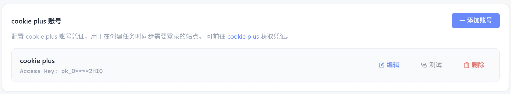
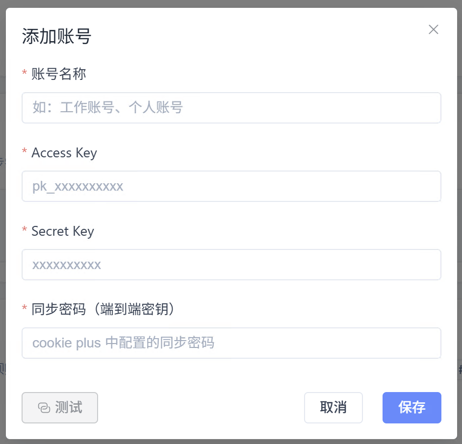

# cookie plus 账号

很多网站的内容必须 **登录后才能看到**（如内部系统、会员价、专属公告）。
通过 cookie plus 同步浏览器登录态，绑定后 **网站内容** 与 **HTTP 请求** 任务可携带 Cookie 访问目标站点。

## 什么是 cookie plus

[cookie plus](https://cookieplus.perk-net.com) 是破壳网络出品的账号与登录态同步服务：在 cookie plus 中登录一次，网页侦探即可使用同一份登录态访问需登录页面。

> 网页侦探本身不存储你的网站密码，登录入口由 cookie plus 提供。

## 准备工作

1. 在 Chrome / Edge 安装 [cookie plus 扩展](https://cookieplus.perk-net.com)
2. 在扩展中完成账号登录
3. 在目标网站登录一次，扩展会把登录态归集到 cookie plus
4. 在扩展「我的密钥」页生成 **Access Key / Secret Key** 与同步密码

## 操作步骤

<ol class="feature-step-list">

<li>

### 打开「我的」中的 cookie plus 区域

在客户端底部或侧栏进入 **「我的」**，找到 **cookie plus 账号** 卡片。暂无账号时会提示点击上方按钮添加。

</li>

<li>

### 添加账号并测试连接

点击 **「添加账号」**，填写账号名称、Access Key、Secret Key 与同步密码（须与扩展中一致），可先 **测试** 再保存。

| 字段 | 必填 | 说明 |
| --- | --- | --- |
| 账号名称 | ✅ | 如「工作账号」 |
| Access Key | ✅ | 扩展「我的密钥」中的 ak |
| Secret Key | ✅ | 对应的 sk |
| 同步密码 | ✅ | 端到端密钥，与扩展一致 |

</li>

</ol>

## 在任务中使用

创建 / 编辑 **网站内容** 或 **HTTP 请求** 任务时，在 Cookie 配置区选择 **「cookie plus 同步」**，选定账号与域名身份；执行时客户端自动拉取最新 Cookie。

## 多账号与排查

- 可绑定多个账号，不同任务选用不同账号，互不影响
- **连接失败**：检查 Key 是否多空格；**解密失败**：检查同步密码是否与扩展一致
- **任务报未登录**：确认扩展端已在目标网站登录过一次
