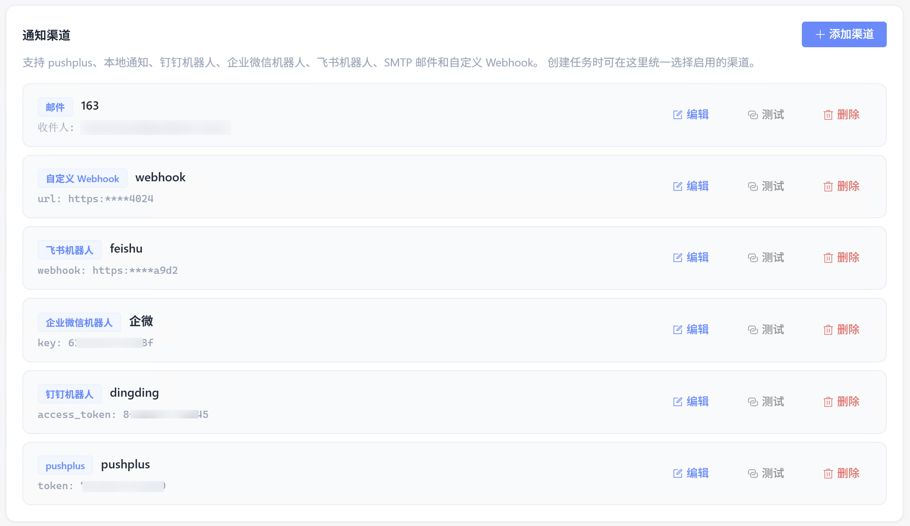
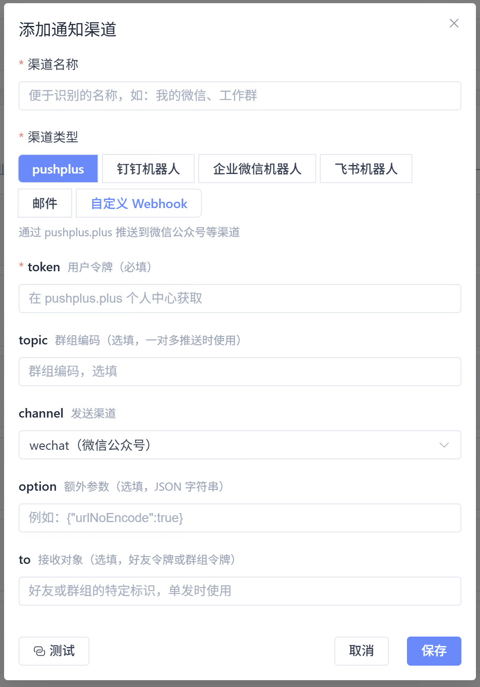

# 通知渠道

统一管理任务变更的推送方式。创建任务时 **多选** 已配置的渠道，一次命中可同时推送到微信、钉钉、桌面等。客户端入口：**「我的」→ 通知渠道**，点击「添加渠道」进行配置。

## 支持的渠道类型

| 类型 | 说明 | 会员要求 |
| --- | --- | --- |
| pushplus | 推送到微信公众号等，需 [token](https://www.pushplus.plus) | 免费版 |
| 本地通知 | 客户端桌面弹窗 | 免费版 |
| 钉钉 / 企微 / 飞书机器人 | 群机器人 Webhook | 免费版 |
| SMTP 邮件 | 发件服务器 + 收件人 | 普通会员及以上 |
| 自定义 Webhook | JSON 推送到自有服务 | 高级会员，详见 [自定义 Webhook](./notify-webhook) |

## 操作步骤

### 打开「我的」中的通知渠道区域

进入 **「我的」**，在 **通知渠道** 卡片中查看已添加的渠道；列表为空时点击 **「添加渠道」**。

### 添加渠道并测试

选择渠道类型（如 pushplus、钉钉机器人等），填写名称与必填参数（token、Webhook 等），保存前可 **测试** 是否收到消息。

## 创建任务时绑定

开启通知后，在任务表单的 **「通知渠道」** 多选框勾选要使用的渠道。一个任务可绑定多个渠道。

## 使用提示

- 超出当前会员等级的渠道类型需升级后再添加
- 在客户端「消息记录」中可查看发送回执
- Token、密码等敏感字段在界面脱敏显示
