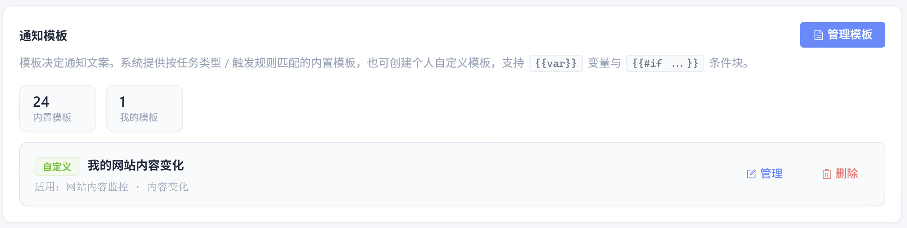
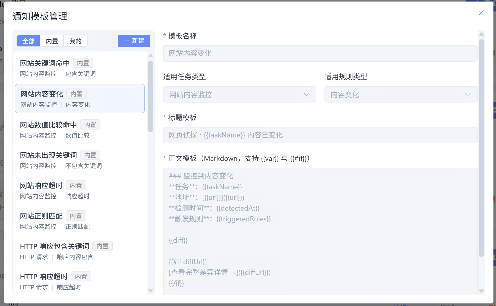

# 通知模板

模板决定变化通知的 **标题与正文** 格式。系统按任务类型与触发规则提供 **内置模板**，也可创建 **自定义模板**，支持 Mustache 变量与条件块。客户端入口：**「我的」→ 通知模板**，点击「管理模板」进行配置。

## 功能说明

| 能力 | 说明 |
| --- | --- |
| 内置模板 | 按任务类型 + 规则类型自动匹配，创建任务时不选模板即生效 |
| 自定义模板 | 可基于内置模板克隆，或从零新建 |
| 变量替换 | 如 taskName、url、diff、statusCode 等 |
| 条件块 | 如 `#if hasDiff` … `/if`，控制段落是否输出 |

## 操作步骤

<ol class="feature-step-list">

<li>

### 查看通知模板概览

在 **「我的」** 页面可看到内置模板数量与「我的模板」数量；尚无自定义模板时会提示通过「管理模板」克隆或新建。

</li>

<li>

### 管理模板：克隆或新建

点击 **「管理模板」** 打开弹窗，浏览内置列表与变量说明；可 **克隆** 内置模板或 **新建**，并指定适用的任务类型与规则类型。

</li>

</ol>

## 常用变量

| 变量 | 说明 |
| --- | --- |
| taskName | 任务名称 |
| taskTypeLabel | 任务类型（中文） |
| url | 监控网址 |
| detectedAt | 检测时间 |
| triggeredRules | 触发的规则 |
| diff | 差异详情（网站/HTTP/RSS） |
| statusCode | HTTP 状态码（仅 HTTP） |
| daysRemaining | 剩余天数（域名/证书） |
| avgLatencyMs | 平均延迟（Ping） |

在正文中使用 Mustache 双花括号包裹变量名，例如 `taskName` 写作 <code v-pre>{{taskName}}</code>。

## 在任务中选用

创建或编辑任务、开启通知后，在 **「通知模板」** 下拉框选择自定义模板；不选则自动匹配内置模板。删除自定义模板前请确认无任务引用。

## 使用提示

- 变量是否可用取决于任务类型
- 微信等渠道有长度限制，重要信息建议放在标题
