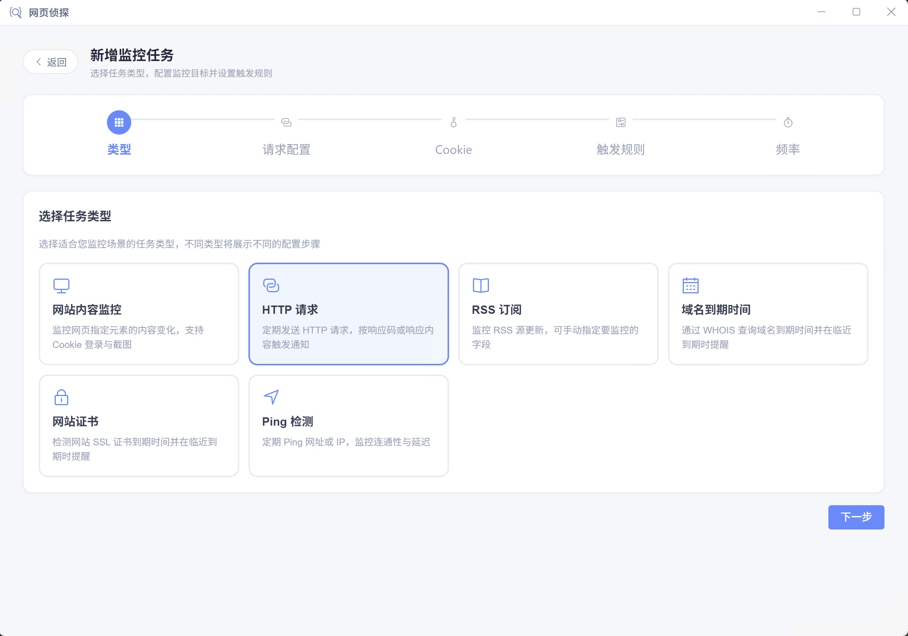
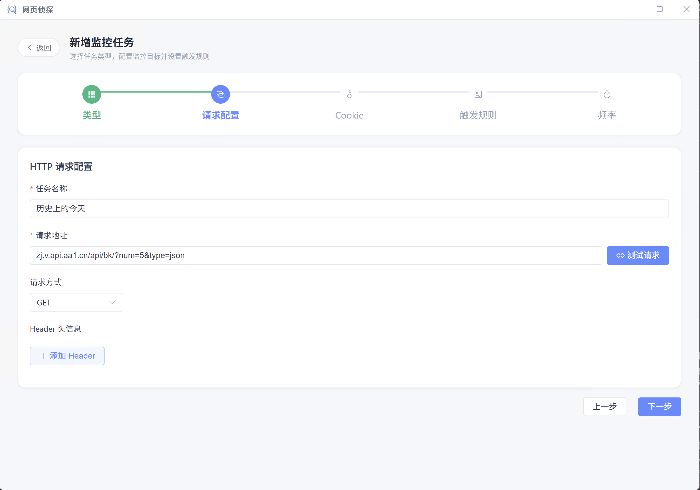
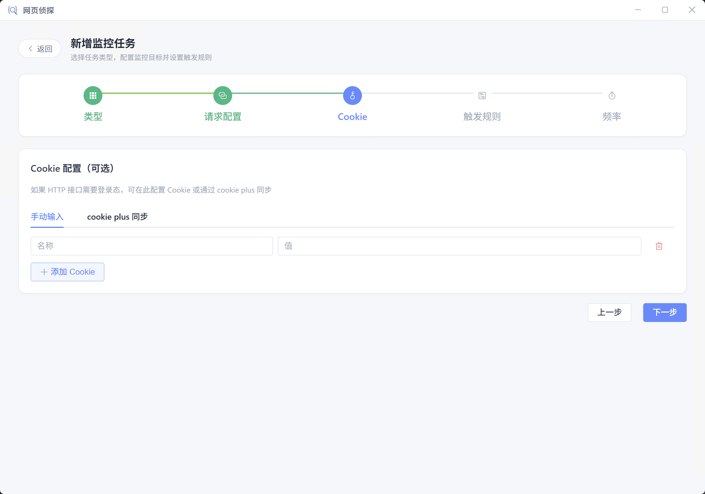
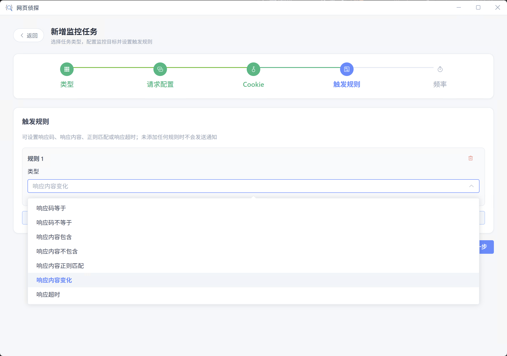
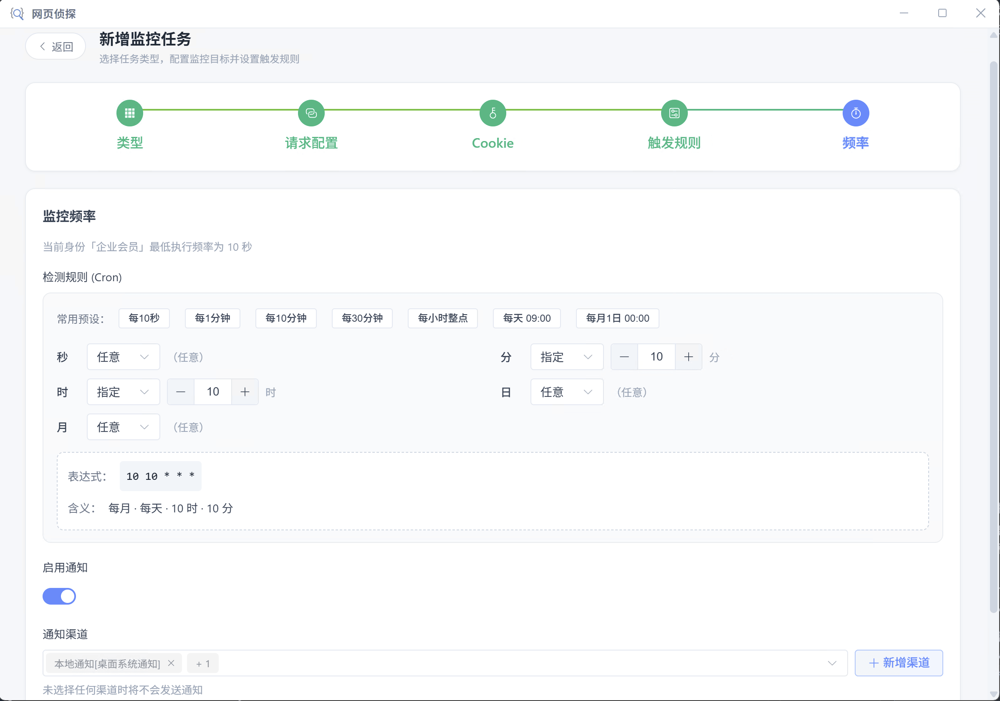

# HTTP 请求

定期向指定 URL 发送 GET/POST/PUT 等请求，可配置请求头、请求体与 Cookie，适合 **接口可用性与响应内容** 巡检。不依赖浏览器渲染，比网站内容监控更轻量、更适合 API 场景。

## 适用场景

- API 健康检查与 HTTP 状态码监控
- 接口返回 JSON 字段变化或异常文案告警
- 需要 Authorization、自定义 Header 的内部服务探测
- 需登录态的 REST 接口（配合 Cookie 或 [cookie plus](./cookie-plus.md)）

## 执行流程

每次调度或「立即执行」时，客户端在 **运行节点** 本地发起 HTTP 请求：

1. 解析 [全局变量](./global-vars.md) 占位符，合并 Cookie（含 cookie plus 实时拉取）
2. 按配置的方法、Header、Body 请求目标 URL（单次超时 **30 秒**，最多跟随 **5 次** 重定向）
3. 将响应状态码与响应体（最多 **50000 字符**）写入执行快照
4. 与上次快照比对，按 **触发规则** 决定是否发送通知

::: info 状态码与执行结果
网络错误、DNS 失败、连接超时等会导致任务 **执行失败**。HTTP **4xx / 5xx** 仍视为 **执行成功**，状态码保存在快照中，可通过「响应码等于/不等于」等规则告警。
:::

## 创建步骤

向导共 **5 步**：类型 → HTTP 请求配置 → Cookie → 触发规则 → 频率与通知。

### 选择 HTTP 请求类型

在客户端点击「新建任务」，选择「**HTTP 请求**」。该类型不打开浏览器，直接在本地用 HTTP 客户端发请求。

### HTTP 请求配置

配置任务标识、运行方案与完整请求参数。

**任务名称**

- 必填，用于任务列表与通知展示
- 同一账号下不可重名
- 建议写清接口用途，如「订单 API 健康检查」「用户中心 status 接口」

**运行客户端**

控制请求从哪台客户端发出。三种方案与会员限制见 [运行客户端](../client/run-client.md)。

| 方案 | 说明 | 适用场景 |
| --- | --- | --- |
| 单节点 | 在锚定或最早在线的一台客户端执行 | 默认；探测公网 API |
| 全节点 | 每台在线客户端各请求一次 | 多地网络质量对比（可能重复通知） |
| 指定节点 | 仅在选定客户端执行 | 只能从内网某台机器访问的 API |

**从 cURL 导入**

- 粘贴浏览器 DevTools 或 Postman 复制的 cURL 命令，一键填充 **请求地址、方法、Header、Body**
- 若 cURL 中含 Cookie，会同步写入下一步的 Cookie 列表
- 适合从现有调试记录快速创建监控任务

**请求地址**

- 必填，须为完整 URL，如 `https://api.example.com/v1/health`
- 支持 `http://` 与 `https://`
- 点击 **测试请求** 可立即发一次请求并预览完整请求/响应（含状态码、Header、Body）；保存前建议先测试确认

**请求方式**

- 支持 **GET、POST、PUT、DELETE、HEAD、PATCH**
- **GET / HEAD** 不发送请求体；选择 POST、PUT、PATCH、DELETE 等时会显示 **请求体** 输入框

**Header 头信息**

| 字段 | 说明 |
| --- | --- |
| Header 名称 | 如 `Authorization`、`Content-Type`、`Accept` |
| Header 值 | 支持 [全局变量](./global-vars.md) 占位符，如 `Bearer {{API_TOKEN}}` |

可添加多条。常见配置：

- `Authorization: Bearer {{API_TOKEN}}` — 鉴权接口
- `Content-Type: application/json` — JSON POST
- `Accept: application/json` — 期望 JSON 响应

若 Header 中未手动设置 `Cookie`，任务 Cookie 配置会自动合并为 `Cookie` 头发送。

**请求体**

- 仅在非 GET/HEAD 方法时显示
- 可填 JSON 文本、表单字符串等原始 Body，按 Header 中的 `Content-Type` 解析
- 支持 [全局变量](./global-vars.md) 占位符
- 适用场景：POST 查询、GraphQL、Webhook 模拟、带参数的创建/更新接口

### Cookie 配置（可选）

公开 API 或无登录态需求时可跳过。需要 Session / Token Cookie 时在此配置。

**手动输入**

| 字段 | 说明 |
| --- | --- |
| 名称 | Cookie 名 |
| 值 | Cookie 值；支持 [全局变量](./global-vars.md) 占位符 |

执行时拼成 `Cookie` 请求头。若 Header 列表中已存在 `Cookie` 项，则 **不会** 自动追加，以避免重复。

**cookie plus 同步**

与网站监控相同：选择 **账号、身份、监控域名** 后绑定，执行时自动拉取最新 Cookie。拉取失败时会尝试使用本地缓存。详见 [cookie plus 账号](./cookie-plus.md)。

::: warning Cookie Plus 同步模式
使用 cookie plus 时，手动 Cookie 列表不再生效；域名须与接口所在站点匹配。
:::

### 配置触发规则

定义 **何时发送通知**。可添加多条规则，或使用 **规则组** 嵌套 AND/OR 逻辑。

**单条规则参数**

| 参数 | 适用规则 | 说明 |
| --- | --- | --- |
| 类型 | 全部 | 见下文「触发规则」表格 |
| 响应码 | 响应码等于 / 不等于 | 100～599，与本次 HTTP 响应状态码比较 |
| 关键词 | 响应内容包含 / 不包含 | 匹配 **响应体** 文本；支持 [全局变量](./global-vars.md) |
| 字段路径 | JSON 字段判断 | 点分路径，如 `code`、`data.total`、`items[0].status`；对 **响应体 JSON** 解析后取值（请写 `data.total`，不要写 `body.data.total`） |
| 运算符 | JSON 字段判断 | 等于、不等于、大小比较、包含、存在、值变化等 |
| 期望值 | JSON 字段判断 | 与字段值比较的目标 |
| 运算符 | 响应内容正则匹配 | 匹配 / 不匹配 |
| 正则表达式 | 响应内容正则匹配 | 可写 `/pattern/flags` 或纯 pattern |
| 超时阈值（秒） | 响应超时 | 1～300；留空表示仅在发生超时 **错误** 时触发，填写后整次请求耗时超过该秒数也会触发 |

**逻辑组合**

- 多条顶层规则时可选 **满足全部 (AND)** 或 **满足任一 (OR)**
- **规则组** 内可再设组内 AND/OR，例如「状态码等于 200 **且** 响应体包含 `"ok":true`」

::: tip
「响应内容变化 / 无变化」比对的是 **响应体** 文本，不含状态码。若只关心状态码，请使用「响应码等于/不等于」规则。
:::

### 频率与通知

设置 Cron 调度、随机延迟与通知渠道，保存任务。

**检测规则 (Cron)**

- 通过分、时、日、月、周字段或 **常用预设** 配置检查频率
- 会员等级限制 **最低执行间隔**（界面会提示当前身份允许的最小频率）

**随机延迟**

| 配置项 | 说明 | 适用场景 |
| --- | --- | --- |
| 开关 | 到达 Cron 时间点后，再随机等待一段时间才发起请求 | 避免固定时刻集中打接口 |
| 延迟时间范围 | 最小～最大秒数；最大不可超过当前 Cron 间隔 | 如每 5 分钟检查，可设 0～120 秒随机延迟 |

**启用通知**

- 关闭时：即使规则满足也不发送任务级通知（执行记录仍会保存）
- 开启时须选择至少一个 **通知渠道**（含本地通知、pushplus、钉钉、飞书等，部分渠道需会员）

**通知模板**

- 留空时按任务类型与主规则 **自动匹配** 内置默认模板
- 可预览模板效果，或在「管理模板」中自定义 [通知模板](./notify-template.md)
- 模板中可使用 `statusCode` 等 HTTP 任务变量

## 触发规则

HTTP 请求支持以下规则类型（可添加多条，支持规则组与 AND/OR 组合）：

| 规则类型 | 说明 | 典型场景 |
| --- | --- | --- |
| 响应码等于 | 状态码等于指定值 | 必须为 200 才正常 |
| 响应码不等于 | 状态码不等于指定值 | 非 200 即告警 |
| 响应内容包含 | 响应体包含关键词 | 出现 `error`、`Exception` |
| 响应内容不包含 | 响应体不含关键词 | 不应出现 `maintenance` |
| JSON 字段判断 | 解析响应体 JSON 后按字段路径比较 | `code` 不等于 0、`data.status` 为 `offline` |
| 响应内容正则匹配 | 按正则匹配响应体 | 复杂格式校验 |
| 响应内容变化 | 响应体与上次快照不同 | 接口返回数据变更 |
| 响应内容无变化 | 响应体与上次快照相同 | 长时间无更新告警 |
| 响应超时 | 整次请求耗时超过阈值或发生超时错误 | 接口响应过慢 |

::: tip 未添加规则时不通知
与其它任务类型相同：**未添加任何触发规则时，即使接口返回 500 也不会发送任务级通知**。请至少添加一条规则（如「响应码不等于 200」）。
:::

## 相关文档

- [cookie plus 账号](./cookie-plus.md) — 登录态同步
- [全局变量](./global-vars.md) — Header 值、Cookie 值、请求体占位符
- [运行客户端](../client/run-client.md) — 单节点 / 全节点 / 指定节点
- [通知渠道](./notify-channel.md) · [通知模板](./notify-template.md)
