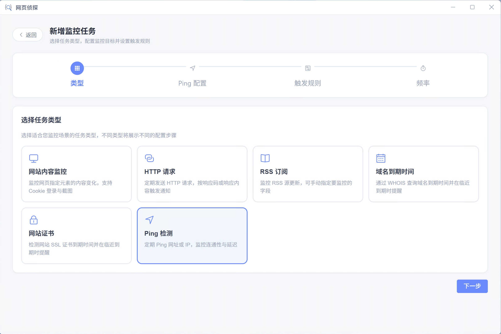
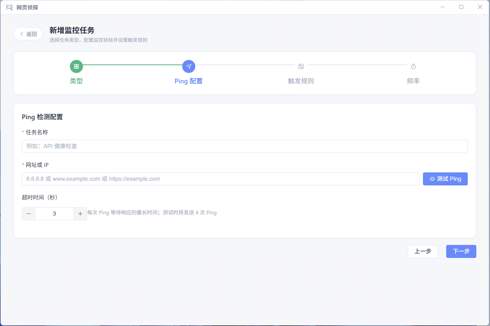
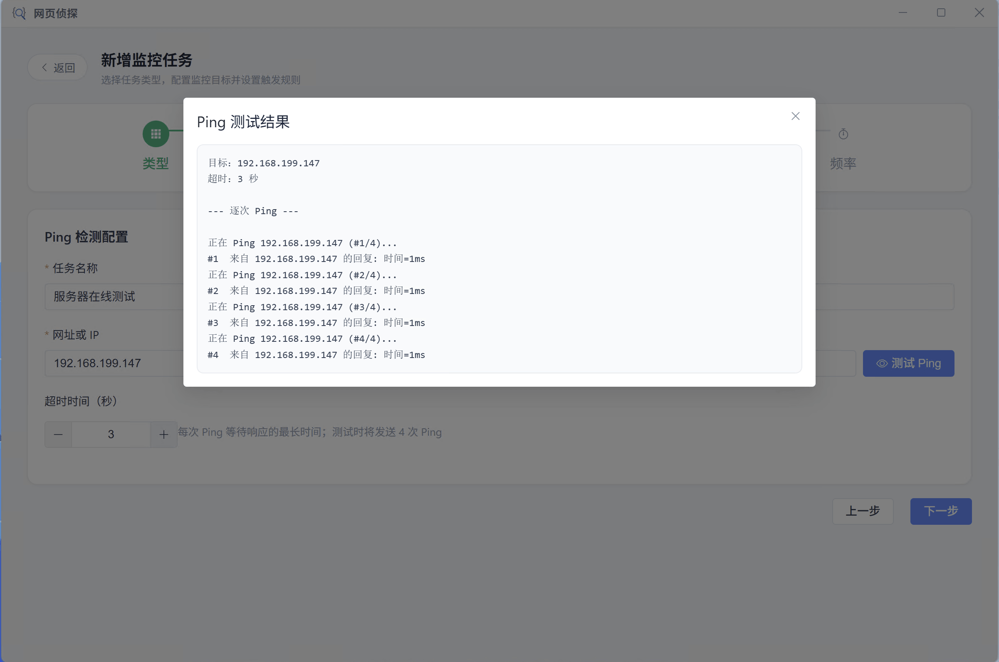
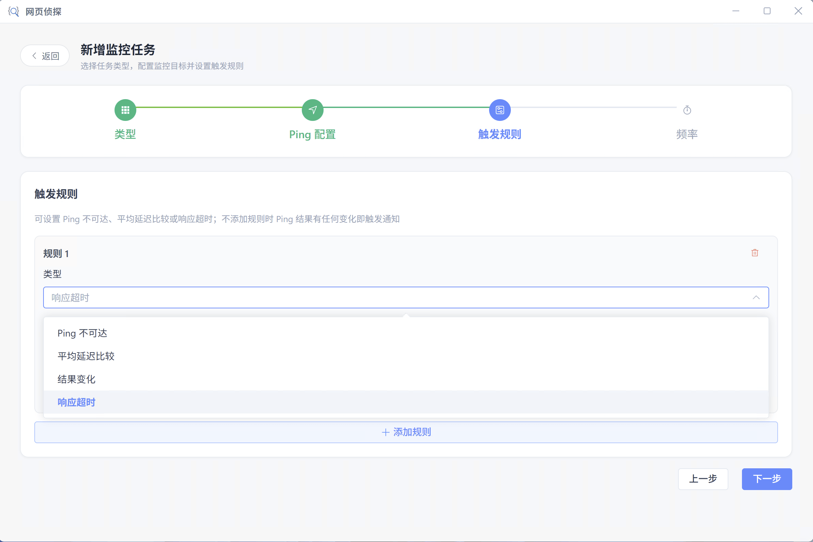
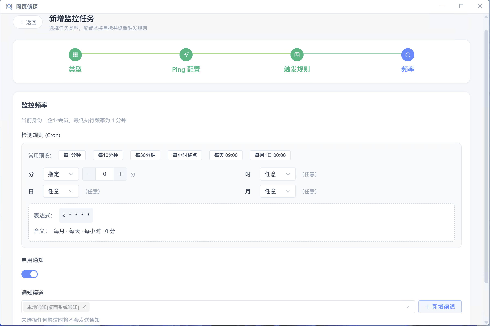
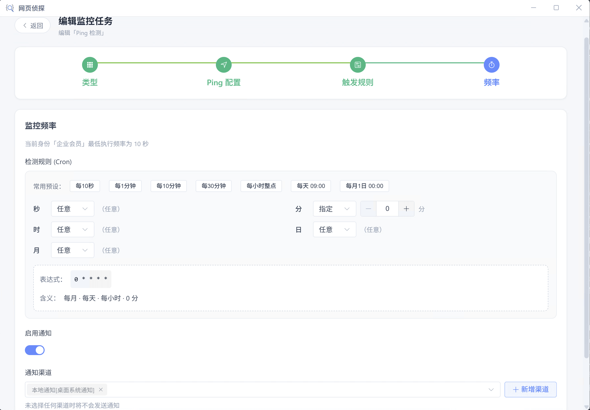

# Ping 检测

定期 Ping 域名或 IP（支持从 URL 自动解析主机），可配置超时，监控 **连通性与平均延迟**。

## 适用场景

- 服务器/网关连通性监控
- 网络质量与延迟趋势告警
- 从 URL 自动提取主机做可达性检查

## 创建步骤

<ol class="feature-step-list">

<li>

### 选择 Ping 检测类型

新建任务时选择「Ping 检测」。

</li>

<li>

### 填写网址或 IP

可直接填 IP/域名，也可填完整 URL，系统会自动解析主机名。

</li>

<li>

### 设置超时时间

根据网络环境调整单次 Ping 超时，避免弱网误报。

</li>

<li>

### 客户端内测试（可选）

创建过程中可一键测试 Ping，确认目标可达与延迟基线。

</li>

<li>

### 配置触发规则

例如：不可达、平均延迟大于阈值、与上次结果变化等。

</li>

<li>

### 频率与通知

设置执行频率并绑定通知。通知可含 avgLatencyMs、reachable 等模板变量。

</li>

</ol>

## 触发规则

Ping 不可达、平均延迟比较、结果变化、响应超时
