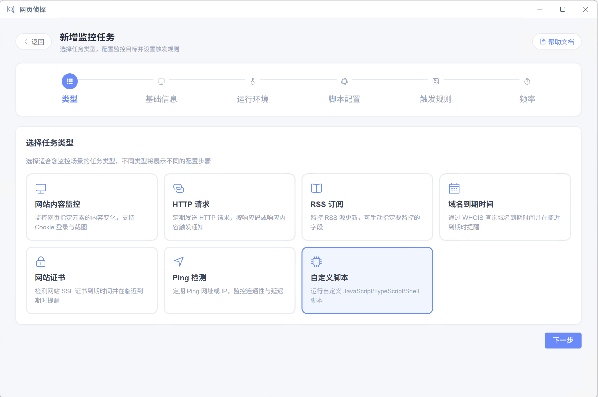
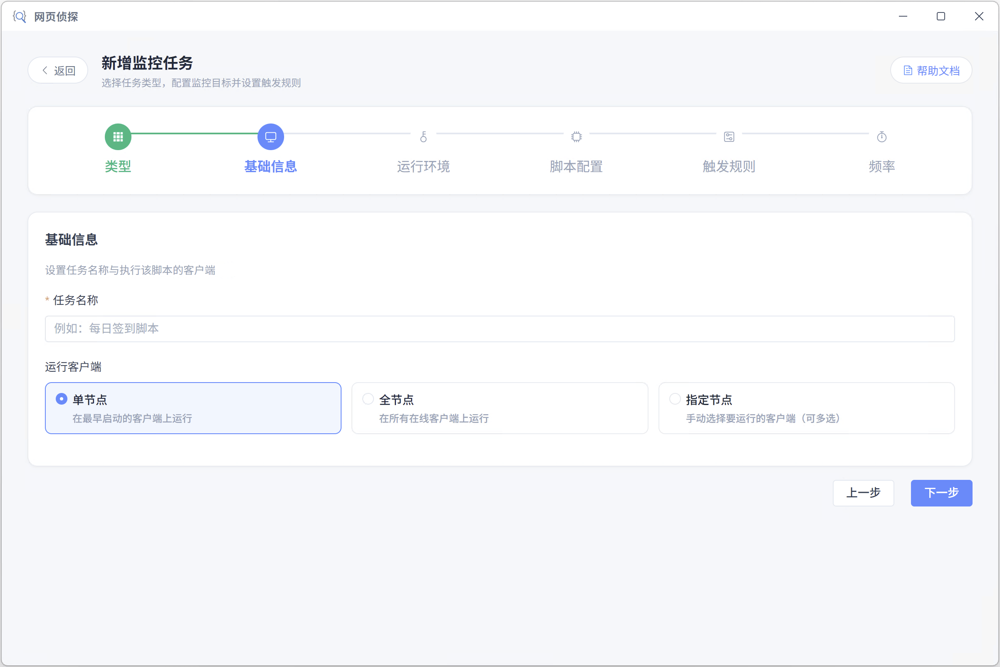
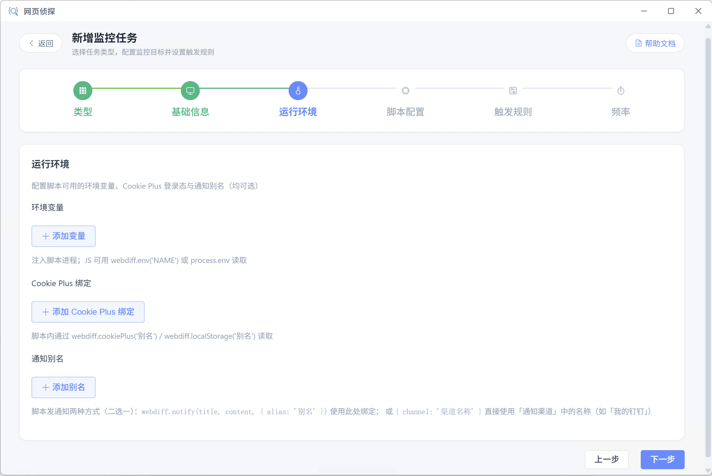
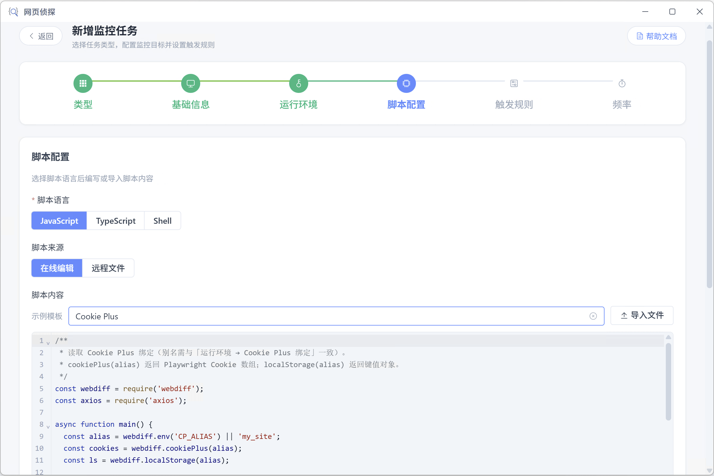
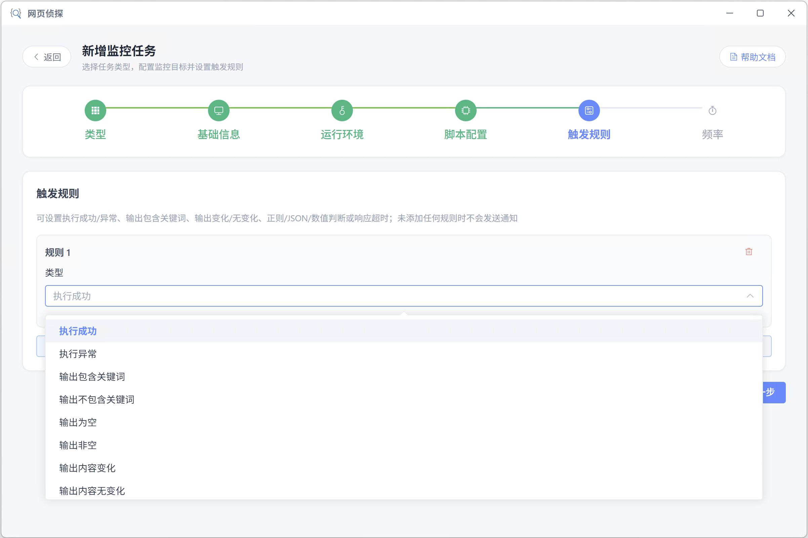
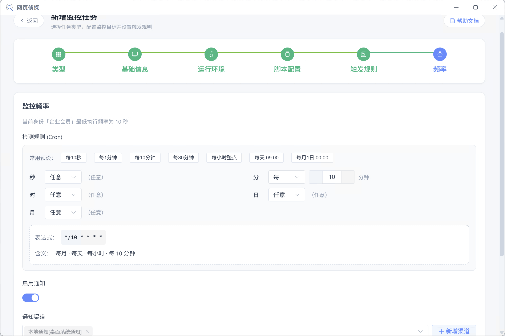

# 自定义脚本

在客户端指定的 **运行节点** 上执行 JavaScript、TypeScript、Python 3 或 Shell 脚本，按 Cron 定时运行，通过标准输出与退出码参与触发规则匹配；脚本内还可主动调用通知 API。

适合内置监控类型无法覆盖的 **自定义巡检、数据抓取、签到、条件告警** 等场景。

## 适用场景

- 调用第三方 API 并监控返回字段或数值
- 结合 [cookie plus](./cookie-plus.md) 登录态访问需鉴权的接口
- 定时执行 Shell/curl 健康检查，或用 Python（如 `requests`）抓取接口数据
- 脚本内根据业务逻辑主动发通知（与任务级通知规则互补）

## 创建步骤

### 选择自定义脚本类型

新建任务时选择「自定义脚本」。该类型无固定监控 URL，任务标识为 `script://` + 语言（如 `script://javascript`、`script://python3`）。

### 填写基础信息

设置 **任务名称** 与 **运行客户端**（三种运行方案与会员限制见 [运行客户端](../client/run-client.md)）。

### 配置运行环境（可选）

本步三项均可跳过；配置后可在脚本中通过 [WebDiff SDK](../reference/webdiff-sdk.md) 读取。

**环境变量**

- 填写变量名、值与备注（备注仅用于界面辨识）
- 注入脚本进程；JavaScript/TypeScript 可用 `webdiff.env('NAME')` 或 `process.env` 读取
- Python 3：`webdiff.env('NAME')`，未配置时回退 `os.environ`
- Shell 可直接使用 `$变量名`，或通过 `webdiff_env` 读取（与 JS 侧行为一致）

**Cookie Plus 绑定**

- 为每条绑定设置 **别名**、**账号**、**身份**、**域名**；可选 **同步 LocalStorage**
- 别名在脚本内使用，不可重复
- JavaScript/TypeScript：`webdiff.cookiePlus('别名')`、`webdiff.localStorage('别名')`
- Python 3：`webdiff.cookie_plus('别名')`、`webdiff.local_storage('别名')`
- Shell：先 `source "$WEBDIFF_HOME/webdiff.sh"`，再使用 `webdiff_cookie_file` 等辅助函数
- 账号管理见 [cookie plus 账号](./cookie-plus.md)

**通知别名**

- 将别名映射到 [通知渠道](./notify-channel.md)（含「本地通知」）
- JavaScript/TypeScript：`webdiff.notify(title, content, { alias: '别名' })`
- Python 3：`webdiff.notify(title, content, alias='别名')` 或 `channel='渠道名称'`
- 也可不绑定别名，直接在 notify 中指定渠道（JS/TS：`{ channel: '渠道名称' }`；Python：`channel='渠道名称'`；名称须与个人中心一致）

### 编写或引用脚本

**脚本语言**：JavaScript、TypeScript、Python 3、Shell（四选一）。

Python 3 脚本建议文件头写 `#!/usr/bin/env python3`，通过 `import webdiff` 使用 SDK；标准输出用 `print()` 写入执行快照。

**脚本来源**：

| 来源 | 说明 |
| --- | --- |
| 在线编辑 | 在编辑器内编写；支持 **示例模板** 快速填充、**导入文件**（`.js` / `.mjs` / `.cjs` / `.ts` / `.py` / `.sh` / `.bash`，单文件上限 2MB） |
| 远程文件 | 填写 http/https **直链**，扩展名须为 `.js`、`.mjs`、`.cjs`、`.ts`、`.py`、`.sh`、`.bash` |

远程脚本 **拉取方式**：

- **一次**：保存任务时拉取最新脚本并缓存，后续执行使用本地缓存
- **每次**：每次执行前重新从 URL 拉取

**执行超时**：默认 60 秒，可调范围 1～3600 秒。

**依赖（可选）**：

- JavaScript / TypeScript：**npm 依赖**，每行一个包名（如 `axios`、`@types/node`），支持 `pkg@1.2.3`；安装到共享工作目录 `node_modules`
- Python 3：**pip 依赖**，每行一个 PyPI 包名（如 `requests`、`beautifulsoup4`），支持 `pkg==1.2.3`；安装到共享工作目录 `python-site-packages`。运行环境须已安装 **Python 3**（可在 **系统依赖** 中填写 `python3` 以确保可用）
- Shell：**系统依赖**，每行一个包名（如 `jq`、`curl`）；自动识别 apt/dnf/yum/apk/brew 等，Linux 下可能需要 sudo

填写依赖后点击 **安装依赖**；安装过程可查看日志或停止。建议在保存前使用 **运行脚本** 试运行，输出会显示成功/失败状态与 stdout/stderr。

### 定义触发规则

根据脚本 **标准输出** 与 **执行结果** 配置条件，例如：

- **执行异常**：进程非零退出或超时
- **输出包含关键词** / **输出内容变化**
- **输出 JSON 字段判断**：对 stdout 解析 JSON 后按字段路径比较
- **输出数值比较**：从 stdout 提取 **首个数字** 与阈值比较
- **响应超时**：执行耗时超过阈值

可添加多条规则；满足任一已启用规则即触发 **任务级通知**（须在「频率」步骤启用通知并选择渠道）。

### 调度与通知

设置 Cron 执行频率，按需开启 **启用通知** 并选择 [通知渠道](./notify-channel.md) 与 [通知模板](./notify-template.md)。

脚本任务的 `console.log` / `print` / `echo` 等内容会写入 [执行记录](./records.md)，供 diff 类规则比对；与脚本内 `webdiff.notify` 主动发通知相互独立。

## 触发规则

执行成功、执行异常、输出包含/不包含关键词、输出为空/非空、输出内容变化/无变化、输出正则匹配、输出 JSON 字段判断、输出数值比较、响应超时

::: tip 未添加规则时不通知
与其它任务类型相同：**未添加任何触发规则时，即使脚本执行成功也不会发送任务级通知**。若需在脚本内无条件发消息，请使用 `webdiff.notify` / `webdiff_notify`（见 [WebDiff SDK](../reference/webdiff-sdk.md)）。
:::

## WebDiff SDK

自定义脚本通过内置 **WebDiff SDK**（`webdiff` 包）读取运行环境、Cookie Plus 登录态、发送通知、编排其它任务等。执行前客户端会自动下发 SDK 到脚本工作目录，无需单独安装。

完整 API 参考（JavaScript / TypeScript、Python 3、Shell）见 **[WebDiff SDK](../reference/webdiff-sdk.md)**。

::: warning 错误处理
建议在 JS/TS 入口使用 `main().catch(...)` 并 `process.exit(1)`；Python 在异常分支调用 `sys.exit(1)` 或让未捕获异常自然退出；Shell 使用 `set -e` 或显式判断退出码，以便「执行异常」规则正确识别失败。
:::
