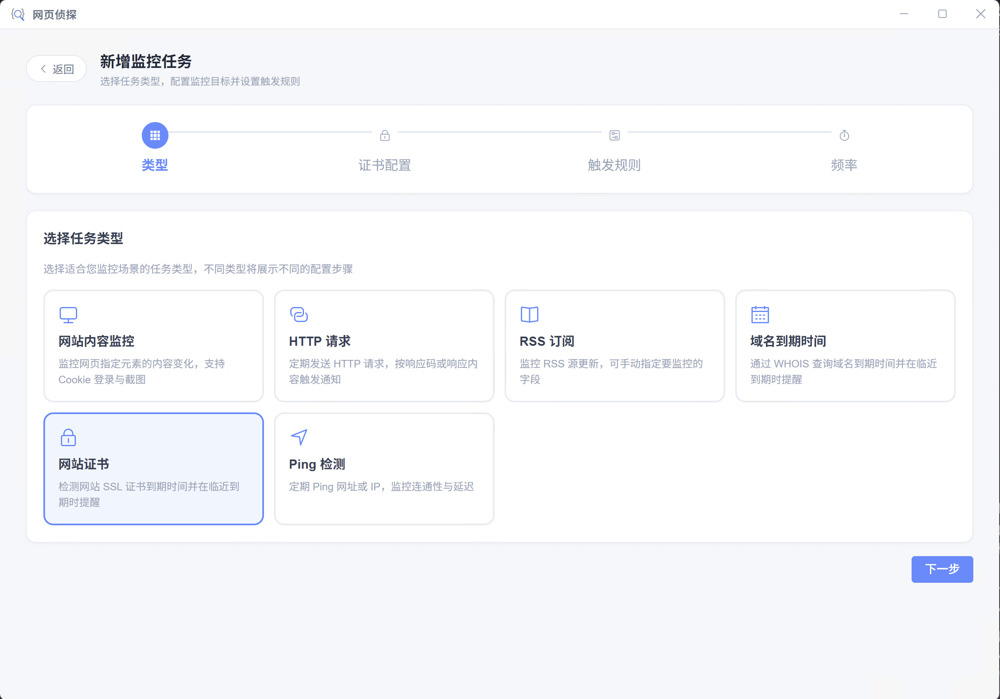
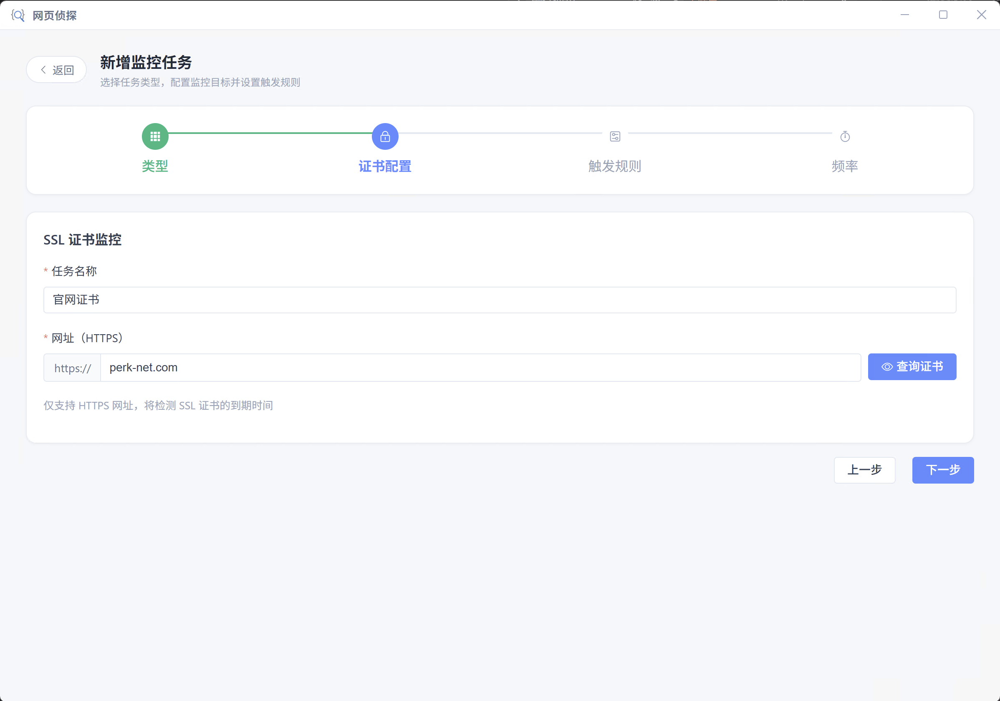
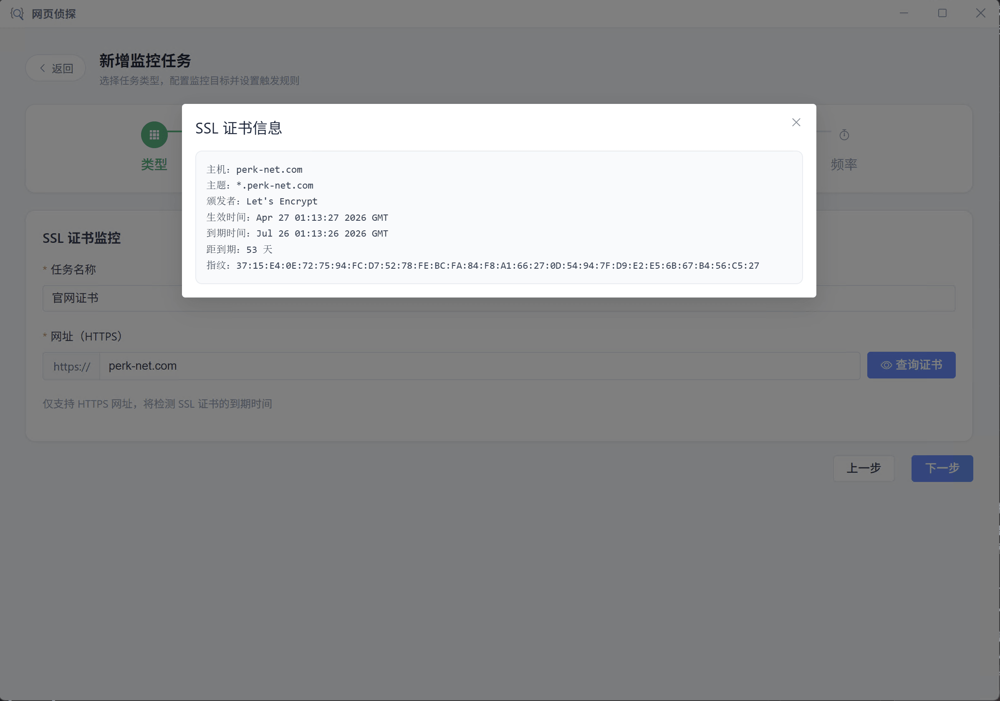
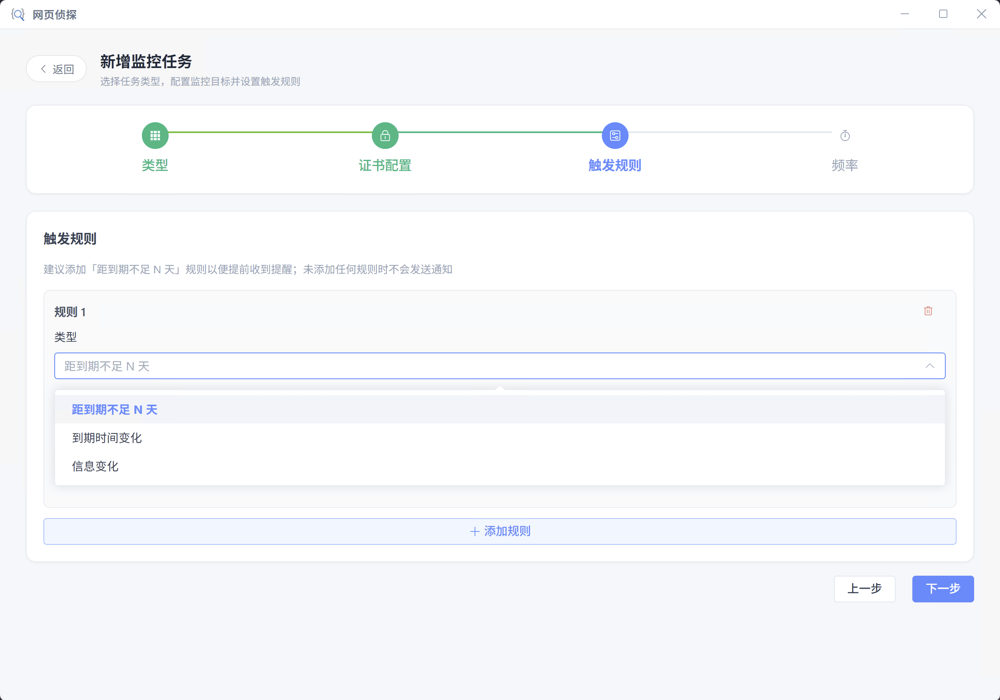
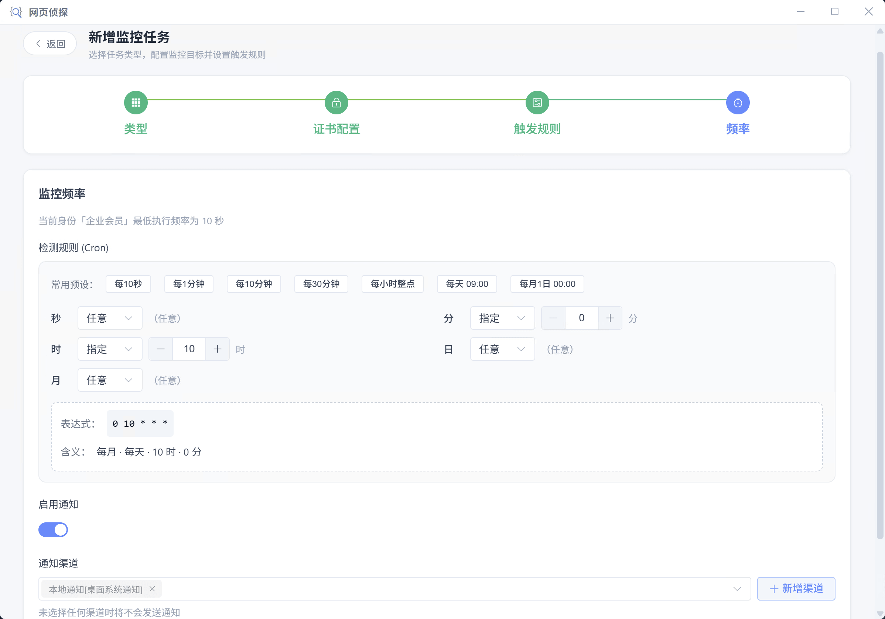

# 网站证书

检测 HTTPS 站点 SSL/TLS 证书有效期，在证书即将过期时推送，避免用户访问时出现证书错误。

## 适用场景

- 生产站点证书临期续签
- 多子域证书统一巡检
- 证书颁发者或到期日变更记录

## 创建步骤

### 选择网站证书类型

新建任务并选择「网站证书」，自动检测目标 HTTPS 站点的 TLS 证书。

### 填写站点 URL

输入 `https://` 开头的地址，客户端会读取证书链与有效期。

### 设置临期规则

例如证书剩余天数少于 30 天时通知。

### 配置检查频率

建议按天检查；证书信息稳定时可适当降低频率。

### 保存并接收提醒

绑定通知后保存。模板可使用 daysRemaining、issuer 等变量。

## 触发规则

距到期不足 N 天、到期时间变化、信息变化
