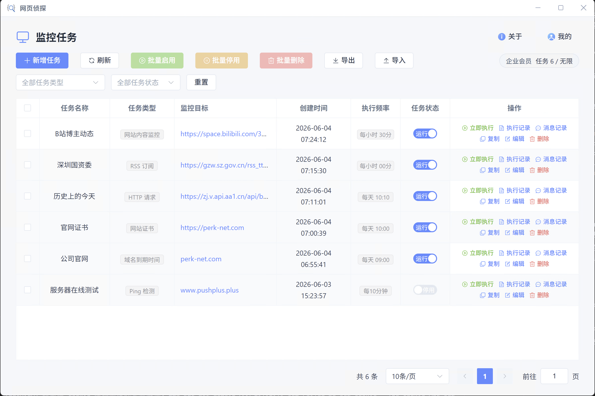

# 监控任务类型

创建任务时先选择类型，客户端会展示对应的配置向导。七类任务共用定时调度、[运行客户端](../client/run-client) 与执行记录；各类型适用场景与触发规则见下方链接的独立说明页。

## 七种任务类型

<a href="./task-website"><strong>网站内容监控</strong>可视化点选 CSS/XPath 元素监测内容变化，内容变化时触发通知</a>

<a href="./task-http"><strong>HTTP 请求</strong>定期向指定 URL 发送 GET/POST 等请求，按状态码或响应体内容（含 JSON 字段）触发通知</a>

<a href="./task-rss"><strong>RSS 订阅</strong>拉取 RSS 源，监测新条目或 title、link、description 等指定字段的变化</a>

<a href="./task-domain"><strong>域名到期时间</strong>通过 WHOIS 查询域名注册与到期信息，在距到期不足 N 天或 WHOIS 信息变更时提醒续费</a>

<a href="./task-ssl"><strong>网站证书</strong>检测 HTTPS 站点的 SSL/TLS 证书有效期，在证书临期或到期信息变更时推送告警</a>

<a href="./task-ping"><strong>Ping 检测</strong>定期 Ping 域名或 IP（可从 URL 解析主机），监测连通性与平均延迟是否异常</a>

<a href="./task-script"><strong>自定义脚本</strong>在运行客户端执行 JS/TS/Shell/Python 脚本，按标准输出、退出码或脚本内主动通知触发告警</a>

## 个人中心配置

以下功能在客户端 **「我的」** 中统一管理，创建任务时直接选用：

| 功能 | 说明 | 文档 |
| --- | --- | --- |
| cookie plus 账号 | 同步浏览器登录态，监控需登录页面 | [cookie plus 账号](./cookie-plus) |
| 通知模板 | 自定义通知标题与正文，支持变量 | [通知模板](./notify-template) |
| 通知渠道 | pushplus、钉钉、邮件等 | [通知渠道](./notify-channel) |
| 开放接口 | 提供任务、客户端与通知等接口，与第三方系统对接 | [开放接口](../reference/open-api) |
