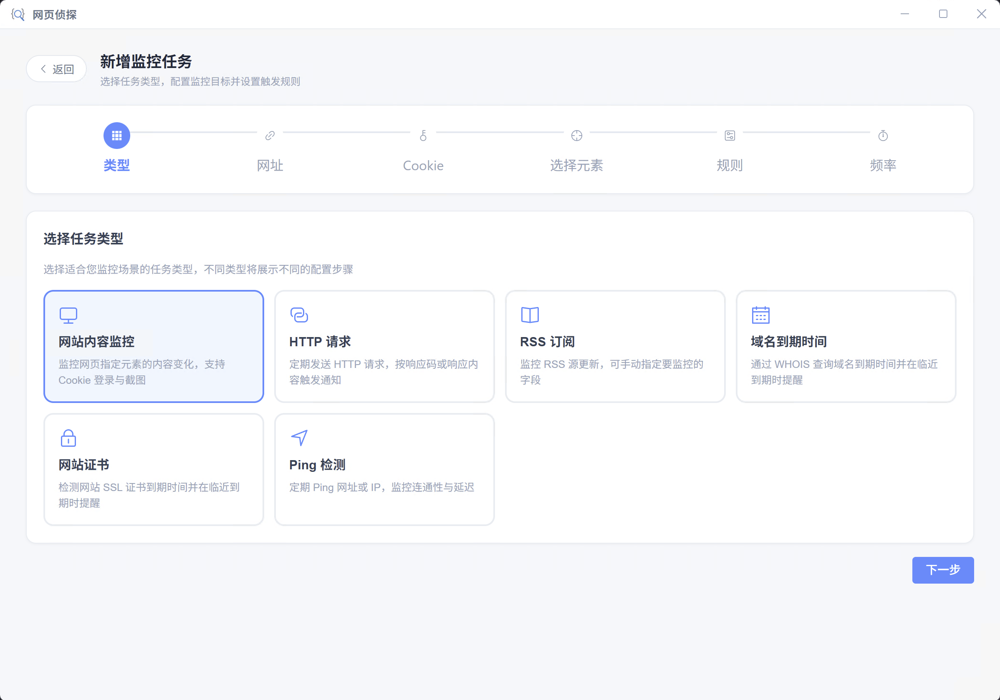
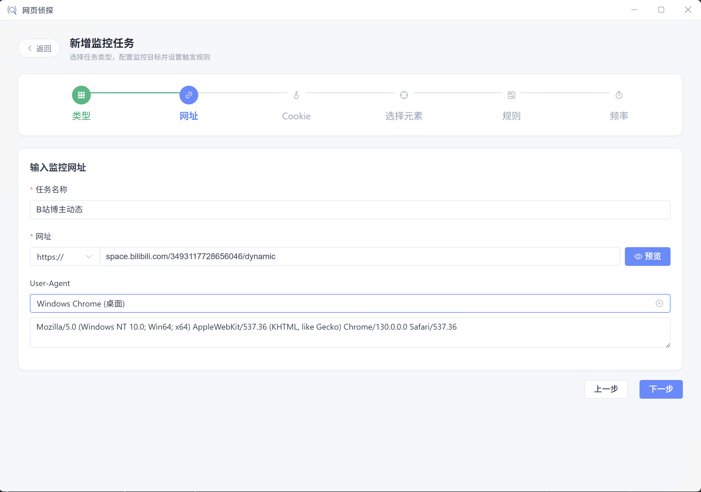
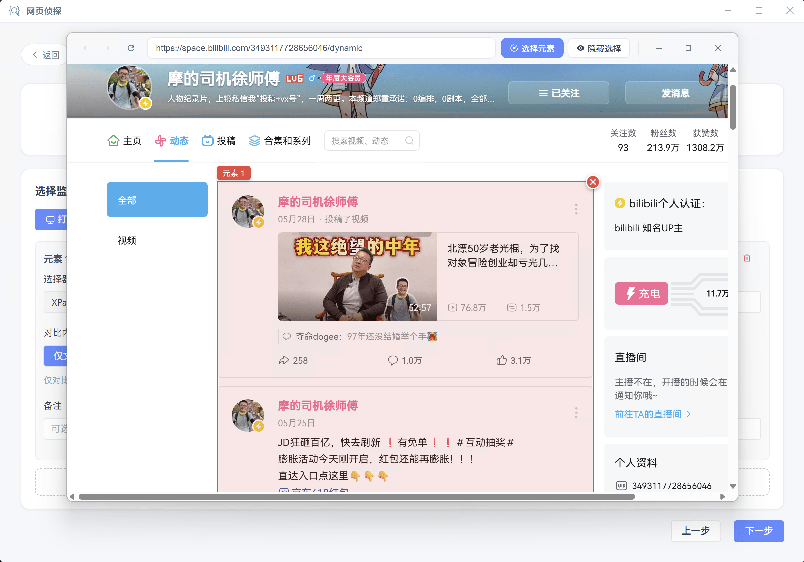
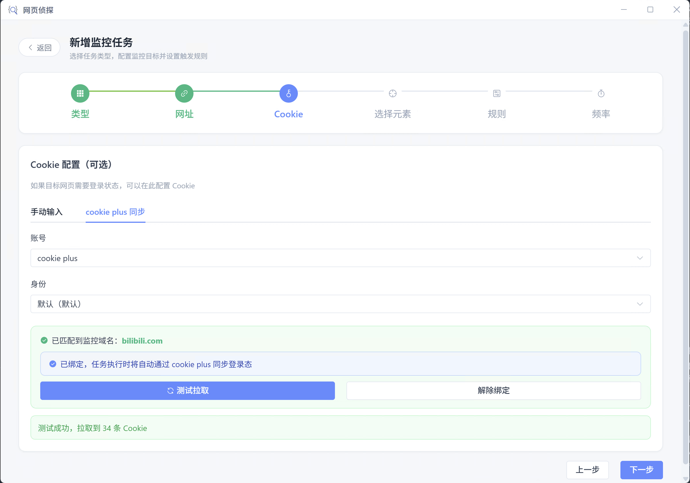
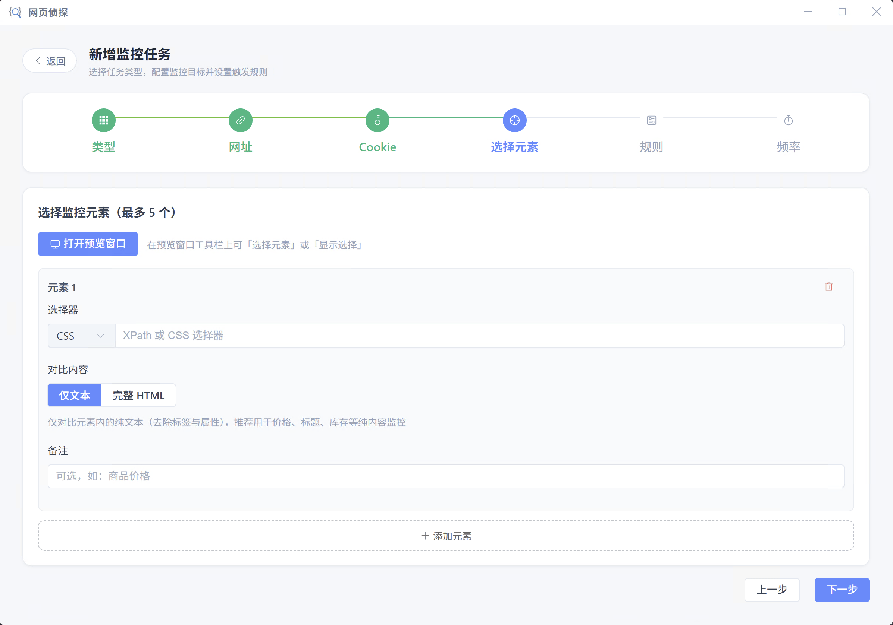
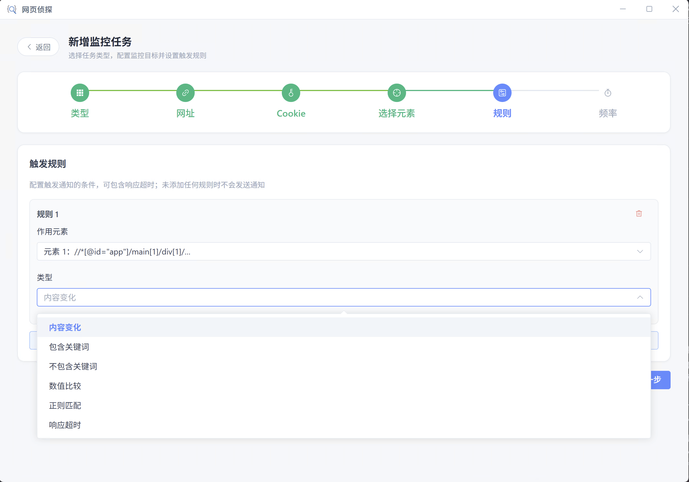
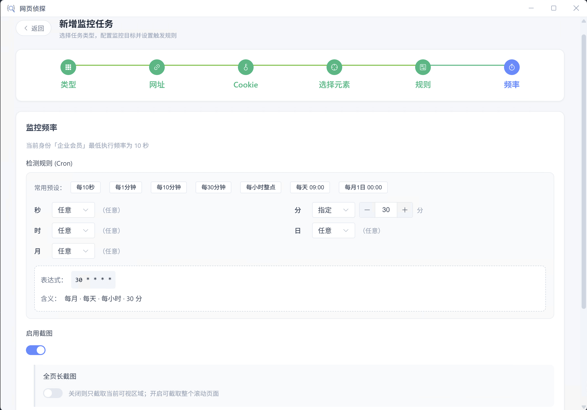

# 网站内容监控

使用浏览器加载页面，**可视化点选**要监控的元素；支持 Cookie、[cookie plus](./cookie-plus) 登录态、**前置操作**脚本与截图。

## 适用场景

- 电商价格、库存、促销文案变化
- 新闻/公告栏、政策条文更新
- 需登录的后台数据看板（配合 cookie plus）
- 目标内容需先点击 Tab、搜索、展开折叠或滚动加载后才出现（配合前置操作与提取前滚动）

## 执行流程

每次调度或「立即执行」时，客户端按以下顺序运行（与创建向导中的步骤对应）：

1. 注入 Cookie / User-Agent，打开监控网址并等待页面稳定
2. **前置操作**（若启用）：登录、点击、输入、跳转等交互
3. **提取前滚动**（若启用）：自动滚动以触发懒加载
4. 按选择器提取各监控元素文本或 HTML
5. **截图**（若启用）：在提取后保存页面截图
6. 与上次快照比对，按 **触发规则** 决定是否发送通知

## 创建步骤

向导共 **7 步**：类型 → 网址 → Cookie → 前置操作 → 选择元素 → 触发规则 → 频率与通知。可点击顶部步骤条在已访问过的步骤间跳转。

<ol class="feature-step-list">

<li>

### 选择任务类型

在客户端点击「新建任务」，选择「**网站内容监控**」。可先浏览任务列表了解已有监控。

</li>

<li>

### 输入监控网址

配置任务标识、运行环境与访问参数。

**任务名称**

- 必填，用于任务列表与通知展示
- 同一账号下不可重名
- 建议写清监控对象，如「某商品 SKU 价格」「官网公告栏」

**运行客户端**

控制任务在哪台客户端上执行（本地 Cron 调度，非云端代跑）。三种方案与会员限制见 [运行客户端](../client/run-client)。

| 方案 | 说明 | 适用场景 |
| --- | --- | --- |
| 单节点 | 在锚定或最早在线的一台客户端执行 | 默认；个人单设备 |
| 全节点 | 每台在线客户端各执行一次 | 多地独立探测（可能重复通知） |
| 指定节点 | 仅在选择的一台或多台客户端执行 | 依赖本机浏览器环境、固定 CLI 服务器 |

**网址**

- 必填，支持 `http://` 与 `https://`（通过左侧协议下拉选择）
- 可填域名或完整路径，如 `www.example.com` 或 `shop.example.com/item/123`
- 点击 **预览** 可在内嵌/独立预览窗口中打开页面，检查是否能正常访问（不保存任务也可试加载）

**User-Agent**

- 可选；留空使用默认桌面 Chrome UA
- 可从预设中选择：Windows / macOS 桌面 Chrome、Safari、Firefox、Edge，或 iPhone / Android 移动 UA
- 选择 **iPhone / Android 预设** 时，会以 **H5 移动视口** 加载页面，适合监控仅对移动端展示的页面
- 选 **自定义** 可手动编辑完整 UA 字符串
- 支持 [全局变量](./global-vars) 占位符，如 `{{MOBILE_UA}}`

</li>

<li>

### Cookie 配置（可选）

若目标页面需要登录态，在此注入 Cookie；公开页面可跳过本步。

**手动输入**

| 字段 | 说明 |
| --- | --- |
| 名称 | Cookie 名，如 `session_id` |
| 值 | Cookie 值；支持 [全局变量](./global-vars) 占位符 |

可添加多条 Cookie。执行时注入浏览器上下文，与前置操作、元素提取共用同一会话。

**cookie plus 同步**

适合需长期维持登录、Cookie 频繁刷新的站点。须先在 [cookie plus 账号](./cookie-plus) 中添加账号并完成扩展端登录。

| 配置项 | 说明 |
| --- | --- |
| 账号 | 选择已添加的 cookie plus 账号 |
| 身份 | 同一账号下的不同浏览器身份（扩展中配置） |
| 监控域名 | 根据任务网址 **自动匹配** 域名标签；未匹配时可从已配置域名中 **手动添加** |
| 绑定同步 | 确认域名后点击「绑定同步」；执行时自动拉取最新 Cookie |
| 测试拉取 | 绑定后可测试能否成功拉取 Cookie |

多个域名标签时，会 **合并** 这些域名下的 Cookie 一并注入。绑定后手动 Cookie 列表不再使用。

</li>

<li>

### 前置操作（可选）

在页面加载完成后、提取监控元素 **之前** 执行交互脚本，用于登录、关闭弹窗、切换 Tab、搜索筛选、点击「加载更多」等。

**提取前滚动**

| 配置项 | 说明 | 适用场景 |
| --- | --- | --- |
| 开关 | 开启后在前置操作 **之后**、提取元素 **之前** 自动滚动页面 | 列表/详情页内容随滚动懒加载 |
| 最大滚动次数 | 1～100，默认 10；每次滚动后等待视口内资源加载 | 无限滚动页面需设上限，避免一直滚到底 |

::: info 与截图滚动的区别
「提取前滚动」服务于 **元素提取**；「频率与通知」步骤中的截图也有独立的「最大滚动次数」，两者互不影响，可按需分别开启。
:::

**启用前置操作**

- 关闭时：每次执行 **跳过** 前置脚本，在页面加载后直接提取元素（仍可按需开启提取前滚动）
- 开启时：显示录制与代码编辑区

**开始录制 / 停止录制**

- 点击「开始录制」会 **自动打开预览窗口**；在预览中点击、输入、选择下拉等操作会自动转换为代码并 **追加** 到下方编辑器
- 录制登录时，**密码框不会写入明文**，而是生成 `vars.PASSWORD` 等变量占位
- 「停止录制」后可在代码区手动微调；「清空代码」删除全部脚本

**操作代码**

- 填写 **async 函数体**，可使用 `page`、`context`、`vars` 三个参数
- 等价于 `async (page, context, vars) => { /* 你的代码 */ }`
- 支持 Playwright 全部 page API 及完整 JavaScript 语法（`if/for/try` 等）
- 单次执行超时约 **60 秒**；语法错误、运行报错或超时会判定为 **执行失败**，不再继续提取元素

详细写法、示例与注意事项见 **[前置操作脚本](../reference/pre-action-script.md)**。

**变量**

| 字段 | 说明 |
| --- | --- |
| 变量名 | 在代码中用 `vars.变量名` 引用，如 `vars.PASSWORD` |
| 值 | 变量实际值；录制登录时在此填写真实密码、Token 等 |

编辑代码时若出现新的 `vars.xxx` 引用，系统会自动在变量表补齐对应行。敏感信息 **不要** 硬编码在脚本中，应使用变量表。

</li>

<li>

### 选择监控元素

通过可视化挑选器选定要监控的 DOM 区域，最多 **5 个** 元素。

**打开预览窗口**

- 在内嵌浏览器中加载当前网址（含已配置的 Cookie、UA）
- 工具栏提供 **「选择元素」**：鼠标悬停高亮、点击选中 DOM 节点
- **「显示选择」**：高亮已保存的选择器在页面上的匹配结果

选中后系统自动生成选择器，可在此步骤继续编辑。

**选择器**

| 配置项 | 说明 |
| --- | --- |
| 类型 | **CSS** 或 **XPath** |
| 选择器表达式 | 如 `#price`、`.stock-num`、`//div[@class='title']`；支持 [全局变量](./global-vars) |
| 对比内容 | **仅文本**：去除 HTML 标签，对比纯文本（推荐价格、标题、库存） |
| | **完整 HTML**：对比 `outerHTML`，class、style、data 属性变化也会触发 |
| 备注 | 可选，便于在规则与执行记录中识别，如「商品价格」「库存数量」 |

至少添加 **1 个** 有效选择器才能进入下一步。多个元素各自独立提取，触发规则可指定作用在某个元素或全部元素上。

</li>

<li>

### 配置触发规则

定义 **何时发送通知**。可添加多条规则，或使用 **规则组** 嵌套 AND/OR 逻辑。

**单条规则参数**

| 参数 | 适用规则 | 说明 |
| --- | --- | --- |
| 作用元素 | 全部 | **全部元素**：任一元素满足即参与判断（结合顶层 OR 时易触发）；或指定「元素 1～N」仅监控该选择器提取结果 |
| 类型 | 全部 | 见下文「触发规则」表格 |
| 关键词 | 包含 / 不包含关键词 | 支持 [全局变量](./global-vars) |
| 运算符 | 数值比较 | 小于、小于等于、大于、大于等于、等于、不等于 |
| 阈值 | 数值比较 | 与提取内容中 **首个数字** 比较，如 `¥128.00` 取 `128` |
| 运算符 | 正则匹配 | 匹配 / 不匹配 |
| 正则表达式 | 正则匹配 | 可写 `/pattern/flags` 或纯 pattern |
| 超时阈值（秒） | 响应超时 | 1～300；留空表示仅在发生超时 **错误** 时触发，填写后超过该秒数也会触发 |

**逻辑组合**

- 多条顶层规则时可选 **满足全部 (AND)** 或 **满足任一 (OR)**
- **规则组** 内可再设组内 AND/OR，实现如「元素 1 价格变化 **且** 元素 2 包含『有货』」

::: tip
首次执行无历史快照时，「内容变化 / 无变化」类规则通常不会触发，需至少成功执行一次建立基线。
:::

</li>

<li>

### 频率与通知

设置 Cron 调度、随机延迟、截图与通知渠道，保存任务。

**检测规则 (Cron)**

- 通过分、时、日、月、周字段或 **常用预设** 配置执行频率
- 会员等级限制 **最低执行间隔**（界面会提示当前身份允许的最小频率）

**随机延迟**

| 配置项 | 说明 | 适用场景 |
| --- | --- | --- |
| 开关 | 到达 Cron 时间点后，再随机等待一段时间才执行 | 避免固定时刻集中访问目标站 |
| 延迟时间范围 | 最小～最大秒数；最大不可超过当前 Cron 间隔 | 如每 5 分钟执行，可设 0～120 秒随机延迟 |

**启用截图**

| 配置项 | 说明 | 适用场景 |
| --- | --- | --- |
| 开关 | 每次成功提取后保存页面截图到执行记录 | 留档、通知中附带视觉证据 |
| 全页长截图 | 关闭：仅当前可视区域；开启：滚动拼接整页 | 长页面、需看完整布局 |
| 最大滚动次数 | 全页截图前滚动以触发懒加载，1～100 | 与「提取前滚动」独立配置 |

**启用通知**

- 关闭时：即使规则满足也不发送任务级通知（执行记录仍会保存）
- 开启时须选择至少一个 **通知渠道**（含本地桌面/浏览器通知、pushplus、钉钉、飞书等，部分渠道需会员）

**通知模板**

- 留空时按任务类型与主规则 **自动匹配** 内置默认模板
- 可预览模板效果，或在「管理模板」中自定义 [通知模板](./notify-template)

</li>

</ol>

## 触发规则

网站内容监控支持以下规则类型（可添加多条，支持规则组与 AND/OR 组合）：

| 规则类型 | 说明 | 典型场景 |
| --- | --- | --- |
| 内容变化 | 与上次快照相比，监控内容发生变化 | 价格变动、公告更新 |
| 内容无变化 | 与上次快照相同 | 确认页面长期未更新、巡检「应变化但未变」 |
| 包含关键词 | 提取内容包含指定关键词 | 出现「售罄」「补货」等字样 |
| 不包含关键词 | 提取内容不含指定关键词 | 监控栏位不应出现「错误」「404」 |
| 数值比较 | 从提取内容中取 **首个数字** 与阈值比较 | 库存 ≤ 10、价格 < 99 |
| 正则匹配 | 按正则表达式匹配提取内容 | 复杂格式、多模式匹配 |
| 响应超时 | 整次执行耗时超过阈值，或发生超时错误 | 页面加载过慢、前置操作卡死 |

各规则还可配置 **作用元素**（见上文「配置触发规则」步骤）。

::: tip 未添加规则时不通知
与其它任务类型相同：**未添加任何触发规则时，即使内容发生变化也不会发送任务级通知**。
:::

## 相关文档

- [前置操作脚本](../reference/pre-action-script.md) — 脚本 API、录制说明与示例
- [cookie plus 账号](./cookie-plus) — 登录态同步
- [全局变量](./global-vars) — User-Agent、选择器、Cookie 值等占位符
- [运行客户端](../client/run-client) — 单节点 / 全节点 / 指定节点
- [通知渠道](./notify-channel) · [通知模板](./notify-template)
