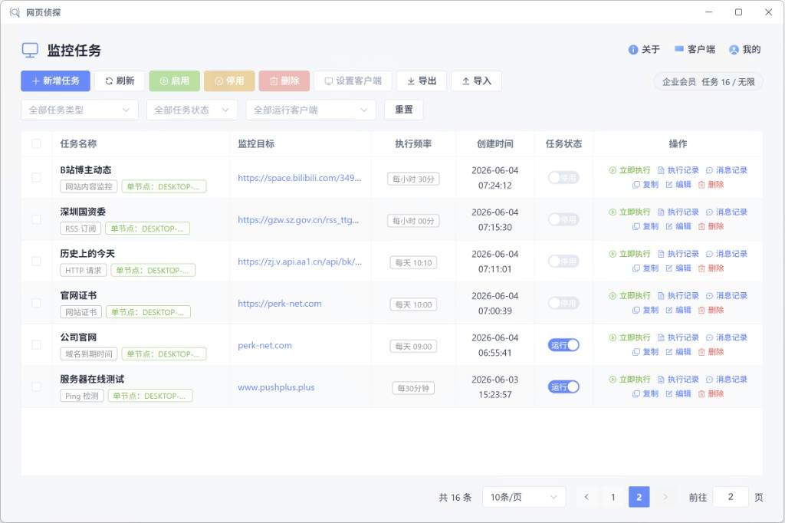

# 快速上手

跟着下面步骤，约 2 分钟内完成第一个监控任务。不同任务类型的配置项不同，但流程一致：**选类型 → 填配置 → 设规则与频率 → 绑通知**。

## 步骤 1：登录账号

> 尚未安装？请先阅读 [安装与部署](installation.md) 完成桌面客户端或 Web 部署。

- **桌面版**：启动客户端，展示微信登录二维码
- **Web 版**：浏览器打开 `http://<主机>:9876`，在页面中扫码登录
- 用 **微信扫一扫** 确认登录
- 登录后会员权益自动同步，免费用户即可创建 **10 个运行中** 任务

二维码过期时，点击「刷新」重新生成。

## 步骤 2：选择任务类型并创建

点击 <kbd>+ 新增任务</kbd>，在类型卡片中选择一种：

| 想监控什么 | 推荐类型 |
| --- | --- |
| 网页上一块区域、价格、公告 | **网站内容监控** |
| API 是否可用、返回内容 | **HTTP 请求** |
| 博客 / 播客 RSS 更新 | **RSS 订阅** |
| 域名什么时候到期 | **域名到期时间** |
| HTTPS 证书还剩几天 | **网站证书** |
| 服务器能不能 Ping 通 | **Ping 检测** |
| 内置类型覆盖不了的巡检、签到、数据抓取 | **自定义脚本** |

各类型详细说明见 [监控任务类型](../features/task-types.md)。

填写 **任务名称**，然后按向导进入后续步骤。

## 步骤 3：按类型完成配置

### 网站内容监控（最常见）

1. 输入目标 **网址**，可选 UA、Cookie（或 cookie plus 账号）
2. 进入内嵌浏览器，点击 <kbd>选择元素</kbd>
3. **悬停高亮、点击选中** 要监控的区域（可多个）
4. 设置 **触发规则**（默认「内容变化」即可）
5. 选择 **执行频率**

### 其他类型（简要）

- **HTTP**：配置方法、URL、请求头 / Body，再设响应码或内容规则
- **RSS**：填写 RSS 地址，选择要监控的字段
- **域名 / 证书**：填写域名或站点 URL，设置「距到期不足 N 天」等规则
- **Ping**：填写主机或 URL，可先在客户端内 **测试 Ping**
- **自定义脚本**：选择 JS / TS / Shell，编写或引用脚本，配置环境变量与触发规则；可用 **运行脚本** 试运行

## 步骤 4：绑定通知并保存

1. 在任务向导最后一步勾选已配置的通知渠道
2. 还没有渠道？进入「我的 → 通知渠道」添加（推荐先配 [pushplus](../features/notify-pushplus.md) 或 [本地通知](../features/notify-local.md)）
3. 保存后任务处于 **运行** 状态，将按频率自动执行

::: tip 立即测试
任务列表中点击 <kbd>立即执行</kbd>，可马上验证配置是否正确、通知能否收到。
:::

## 完成 🎉

第一个任务已跑起来。建议继续了解：

- 📋 [监控任务类型](../features/task-types.md) - 七类任务与触发规则
- 📜 [执行记录与对比](../features/records.md) - 查看历次结果
- 🔔 [通知渠道总览](../features/notify-overview.md)
- ⏱ [定时与执行频率](../features/cron.md)
 